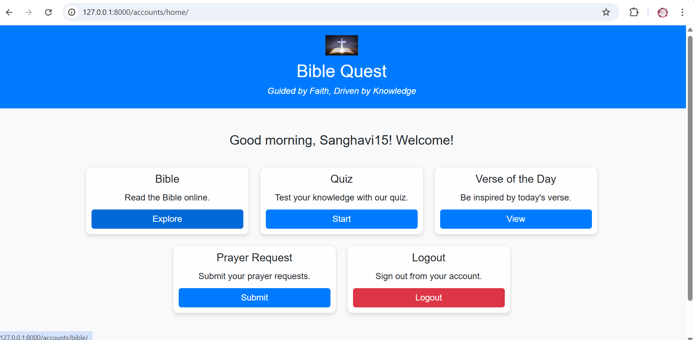
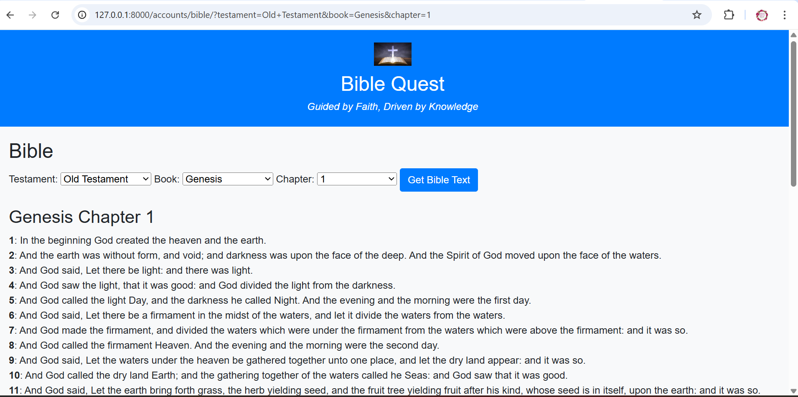
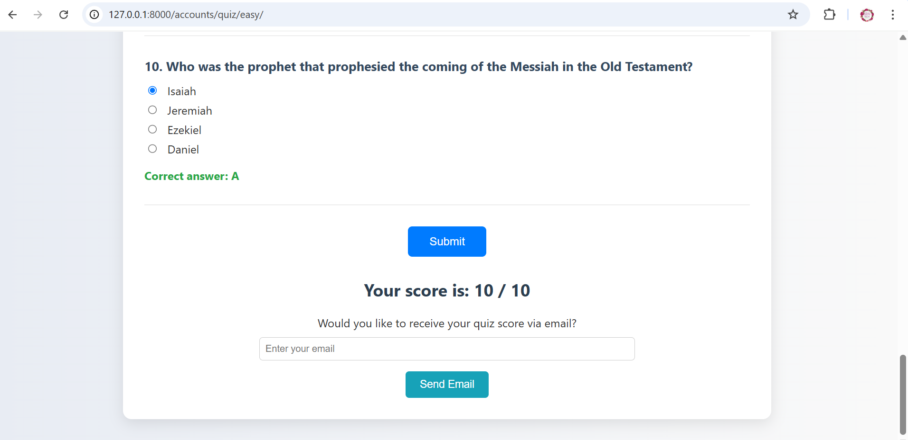
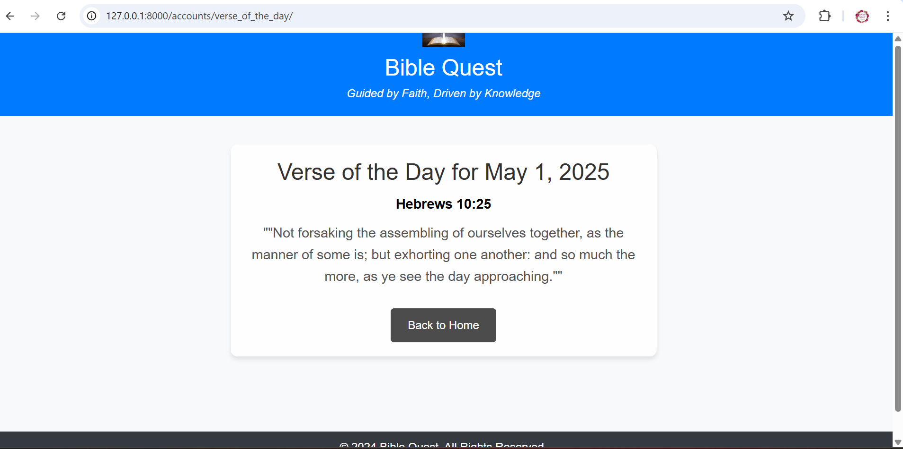
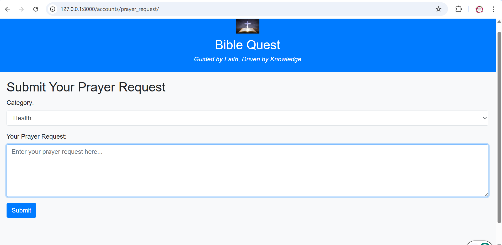

# 📖 BibleQuest: An Interactive Bible Learning Platform

**BibleQuest** is a web-based platform designed to help users engage with Scripture through quizzes, daily verses, prayer requests, and powerful search tools. Built with Django and Python, it demonstrates strong backend design, data handling, API integration, and user interface development — all essential skills in modern data-driven applications.

---

## ✨ Core Features

- 🔐 **User Authentication** – Secure login and registration using Django's authentication system.
- 📚 **Bible Search Tool** – Users can search for Bible verses using the [Bible API](https://bible-api.com), with results from the King James Version.
- ❓ **Quiz Module** – 10-question quizzes dynamically scored using Python logic, with email feedback sent via Django’s email engine.
- 🌤️ **Verse of the Day** – Rotating daily scripture displayed using Python's `datetime` module and backend model logic.
- 🙏 **Prayer Request Wall** – Authenticated users can post categorized requests and comment supportively.

---

## 📸 Screenshots

### 🏠 Home Page  

### 📖 Bible Search  

### ✅ Quiz Result Page  

### 🌅 Daily Verse  

### 🙏 Prayer Wall  

---

## 🧠 Backend and Data Flow Highlights

- **Python-Powered Logic:** Python handles all backend processing — from form validation, quiz scoring, and user session control to API interactions.
- **Efficient Data Storage:** Uses SQLite for development; scalable to PostgreSQL or MySQL. Django ORM efficiently models and queries quiz questions, prayer requests, verses, and user data.
- **Data Handling:** All user inputs are validated and processed securely. Quiz responses are dynamically analyzed for performance.
- **Email Engine:** Personalized emails are sent using Django’s `EmailMultiAlternatives`, showcasing back-end automation capabilities.
- **Pagination & Query Optimization:** Django’s built-in tools keep views performant and clean — especially for prayer walls and verse listings.

---

## 📊 Why It Matters

In a world increasingly driven by data, BibleQuest demonstrates how Python and Django can be used beyond enterprise use cases — to build faith-inspired, community-driven platforms that still showcase:

- Real-time data processing (quizzes, API requests, score calculations)
- Secure, structured data collection (user posts, comments, input forms)
- Meaningful analytics potential (quiz success rates, user engagement, scripture trends)

It proves that **data-powered apps** can also be **mission-driven**.

---

## 🛠️ Tech Stack

- **Language:** Python 3
- **Backend Framework:** Django
- **Frontend:** HTML, Bootstrap, CSS
- **Database:** SQLite (development)
- **API Used:** [Bible API (KJV)](https://bible-api.com)
- **Email:** SMTP via Django

---

## 🚀 How to Run Locally

1. Clone the repository  
   `git clone https://github.com/your-username/biblequest.git`

2. Navigate to the folder  
   `cd biblequest`

3. Install required packages  
   `pip install -r requirements.txt`

4. Apply migrations  
   `python manage.py migrate`

5. Start the local server  
   `python manage.py runserver`

6. Open in browser  
   [http://127.0.0.1:8000](http://127.0.0.1:8000)

---

## 🧪 Testing and Validation

- Manually tested all features across multiple user states (logged-in, logged-out).
- Verified API response handling and error feedback for malformed inputs.
- Checked for edge cases in quiz scoring, comment control, and login flows.
- All backend features run smoothly on localhost with no deployment errors.

---

> *"BibleQuest blends meaningful faith-based engagement with real-world backend development, data processing, and web technology integration — all powered by Python."*

